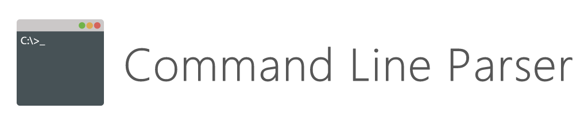

# Command Line Parser



A simple and light-weight parser for command line arguments, which makes it possible to access parameters
from the command line via well-defined .NET data structures.

## Using the Project

If you want to you can download and manually build the solution. The project was built using Visual Studio
Code and .NET Core 2.0. To build the solution, clone the repository and build it using the command line
tools of .NET Core:

```bash
git clone https://github.com/lecode-official/command-line-parser
cd command-line-parser
dotnet build
dotnet test ./test/System.CommandLine.Parser.Tests/System.CommandLine.Parser.Tests.csproj
```

## Contributions

Currently I am not accepting any contributors, but if you want to help, I would greatly appreciate feedback
and bug reports. To file a bug, please use GitHub's issue system. Alternatively, you can clone the repository
and send me a pull request.
